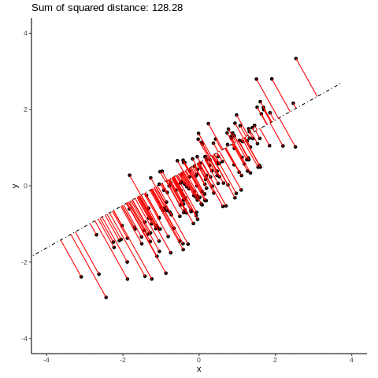

# Introduction

Principal Component Analysis (PCA) is arguably the easiest to understand method for dimensionality reduction. In its simplest definition PCA reduces the number of dimensions of the data such that most of the variability in the data is preserved. PCA identifies principal components (PCs) - a linear combinations of features. The components are ordered such that first component explains the most of the variance, the second - second most and so on. The maximum number of PCs is limited by the number of dimensions in the data (`N`). Selecting the first `n` PCs covers more variability in the data than `n-1` PCs and setting `n = N` preserves all the variance.

The advantages of PCA are that: it is linear and deterministic. Linearity aids understanding and interpretation. Distance between samples in PC space translates to the increased variability between them. PCA has an analytical solution, meaning that there is only one correct answer for each input matrix. 

This notebook was based on the Chapter [In Depth: Principal Component Analysis](https://jakevdp.github.io/PythonDataScienceHandbook/05.09-principal-component-analysis.html) from Python Data Science Handbook. I initially started by trying to replicate the exercises mentioned in the book in R, but ended up diverging from it and exploring other things like explanability.

## Setup

Reading in the necessary packages and setting up defaults.

```{r, warning=FALSE, message=FALSE}
# list all the necessary packages
pkgs <- list(
  "tidyverse", # essential pkgs for data wrangling and visualization
  "gmodels", # for fast PCA
  "patchwork", # ggplot addin - arrange the plots 
  "ggforce", # ggplot addin - add annotations to plots 
  "ggsci", # ggplot addin - pretty color schemes
  "ggridges", # better densities
  "dslabs" # for MNIST dataset
)

# check if pkgs installed, and install after providing a warning if not
invisible(
  lapply(pkgs, function(pkg) {
    if (!library(pkg, character.only = TRUE, logical.return = TRUE)) {
      print(paste0("Warning: Installing the ", pkg, 
                   ". You have 5s to stop the process."))
      Sys.sleep(5)
      install.packages(pkg)
    }
    library(pkg, character.only = TRUE, logical.return = TRUE)
  })
)

# set the default theme for the plots
theme_set(theme_classic() + theme(legend.position = "bottom", 
                                  text = element_text(size = 16)))
```

```{r, echo = FALSE, message = FALSE, warning = FALSE}
knitr::opts_chunk$set(
  message = FALSE, 
  warning = FALSE, 
  fig.align = 'center', 
  cache = TRUE,
  class.source = 'fold-show')
```

# Simulating data 

To get a good sense of what PCA is doing we need to start with data that has known properties. First, let's start with points drawn from a Gaussian Distribution.

```{r}
set.seed(9)
normal_points <- matrix(rnorm(400), 200, 2)
qplot(normal_points[,1], normal_points[,2]) +
  geom_density_2d() +
  coord_equal()
```

Next, we want the data to have a well described structure, hence we will introduce the correlation relationship. In order to achieve that, we will multiply the points we generated in a previous step by a special matrix that will transform our data into correlated points.

```{r}
# A <- matrix(runif(4), 2, 2)
A <- cbind(c(1, 0.5), c(0.5, 1))
X <- normal_points %*% A
qplot(X[,1], X[,2]) +
  geom_density_2d() +
  coord_equal()
```


# 2-D Principal Component Analysis (PCA)

When thinking of the collection of points in N-dimensional space, we can always find a line that will maximize the captured variance. Such line, called Principal Component 1 (PC1), will not describe all aspects of the data, but will create a representation of the data that covers most of the variance. The distance between points on the line will directly translate into how similar (or different) the points are in linear space. 

As for the way that line can be identified - it turns out that capturing most of the variance is equivalent to finding the line from which average squared distance from each point is minimized.  

Example of search for such line is presented on the GIF below. This is animation was generated purely to illustrate a concept of worse and better lines. 

\center

\center

The next best-fitting line is perpendicular to the first one, and so on. We can find N (where N is number of dimensions of the input data) such lines, and per definition, first components cover more variance than later ones. 

In the case of PCA we don't need an iterative optimization, as there is a closed form solution and the PCA can be solved by matrix multiplications. 

```{r}
pca_ <- prcomp(X, center = TRUE, scale. = FALSE)
```

`prcomp` which is the base R implementation of PCA (the one using Singular Value Decomposition - SVD, to calculate PCA; more on differences between two base R implementations of PCA can be found [here for example](https://stats.stackexchange.com/questions/20101/what-is-the-difference-between-r-functions-prcomp-and-princomp)) returns the following:

```{r}
str(pca_)
```

* `sdev` describes standard deviations captured by the Principal Component (i.e. the standard deviation of points as projected on the line of given PC)
* `rotation` - matrix of transformation
* `center` - center of PCA is in the center of the data (i.e. mean in each dimension)
* `scale` - logical, specifying whether the algorithm scaled the input
* `x` - transformed data

The input data can be expressed as follows:

$X = Y R^T + C$

Here:  
$X$ - input data  
$Y$ - projected data   
$R^T$ - rotation matrix  
$C$ - center of the data, 0s if not centered  

Rotation matrix is of size `n` by `n`, where `n` is the number of input dimensions (features). 

```{r}
pca_$rotation
```

And this is how are data looks like when presented in the new coordinate system (i.e. rotated with the rotation matrix).

```{r, class.source = 'fold-hide'}
center_mat <- matrix(rep(colMeans(X), each = nrow(X)), 
                     nrow = nrow(X)) 
transformed_data <- 
  (X - center_mat) %*% pca_$rotation

plt_pca <-
  qplot(transformed_data[,1], # equivalent to: qplot(pca_$x[,1], pca_$x[,2])
        transformed_data[,2], 
        alpha = .4) + 
  labs(x = "PC1", y = "PC2") +
  geom_density2d(alpha = .4) +
  labs(title = "Principal Component projection") +
  coord_equal() +
  theme(legend.position = "none")
plt_pca
```

## Variance explained by the principal components

We can see below that the first principal component captures more than 90% of the variance. 

```{r}
var_expl <-
  pca_$sdev^2 / sum(pca_$sdev^2)
var_expl
```

If we look at the original plot with the the PCs added, we can see how much the points are spread out along side the PC1 and how much less spread out they are alongside PC2. Their distribution on the axes correlates with fraction of the variance each PC is explaining.

```{r, fig.height = 7, fig.width = 14, class.source = NULL}
pc_coord <- 
  data.frame(x = pca_$center[1], y = pca_$center[2], 
             xend = pca_$rotation[1,] * sqrt(var_expl) * 3 + pca_$center[1],
             yend = pca_$rotation[2,] * sqrt(var_expl) * 3 + pca_$center[2], 
             component = paste("PC", 1:ncol(pca_$x)))
```

```{r, fig.height = 7, fig.width = 14}
plt_original_coord <- 
  as_tibble(X) %>%
  ggplot(aes(V1, V2)) +
  geom_point(alpha = .4) +
  geom_density2d(alpha = .4) +
  geom_segment(data = pc_coord, aes(x, y, xend = xend, yend = yend), size = 1,
               arrow = arrow(type = "closed", length = unit(0.1, "inches"))) +
  coord_equal() +
  labs(title = "Original data with PC coordinates") +
  theme(legend.position = "none", text = element_text(size = 16)) 
plt_original_coord + plt_pca + plot_layout(widths = c(1, 1))
```

# PCA as a dimensionality reduction method

Our input data is 2 dimensional, therefore we can practice reducing the dimensions of the data by representing the 2D data in one dimension. And as we saw from the amount of variance explained by first component, reducing the number of dimensions to one we will still cover almost all of the variability in the data, i.e. more than `r floor(var_expl[1]*100)`% of the variance.

```{r, class.source = NULL}
X_ <-  
  pca_$x[, 1] %*% t(pca_$rotation[, 1, drop = FALSE]) + center_mat %>% 
  as_tibble()

as_tibble(rbind(X, X_)) %>%
  mutate(source = c(rep("original data", 200),
                    rep("1D projection", 200))) %>%
  ggplot() +
  geom_point(aes(V1, V2, color = source, shape = source)) +
  coord_equal() +
  labs(title = "1D projection of the points", shape = "", color = "")  +
  scale_color_uchicago()
```

    
# Handwritten digits 

Modified National Institute of Standards and Technology database (MNIST) is a set of digitized handwritten digits. Thanks to the easy visualization methods, dataset is often used in the field of Machine Learning to test and asses models and methods. MNIST contains 70,000 digits, divided 6:1 between train and test datasets. Each digit is represented by a 28 by 28 matrix of pixels, with each pixel representing an intensity in a single channel. 

_Note_: For faster computation, I will be using the test set throughout this notebook.

Using `dslabs::read_mnist()` function, we can directly read in the MNIST dataset into `R`. The dataset is stored as a list with training and test datasets, each storing a matrix with digits in rows and labels vector.

```{r}
mnist <- dslabs::read_mnist()
str(mnist)
```

Each digit as 784 elements vector that can be transformed into 28 by 28 matrix, and needs to be additionally rotated by 90 degrees. 

```{r, class.source = NULL}
mnist_test_df <-
  mnist$test$images %>%
  t() %>%
  as_tibble() %>%
  mutate(x = rep(1:28, 28),
         y = rep(28:1, each = 28)) %>%
  pivot_longer(values_to = "intensity", 
               names_to = "tmp", 
               -c(x, y)) %>%
  mutate(label = rep(mnist$test$labels, 28*28)) %>%
  arrange(label, tmp, x, y) %>%
  group_by(label, x, y) %>%
  mutate(replicate = 1:n()) %>%
  select(-tmp)
```

Let's draw a sample image for each digit to get an idea of how the data looks like.

```{r, class.source = NULL}
rand_repl <- sample(1:800, 1)
sample_digits_plt <-
  mnist_test_df %>%
  filter(replicate == rand_repl) %>%
  ggplot(aes(x, y, fill = intensity)) +
  geom_tile() +
  theme_void() +
  scale_fill_gradient2() +
  theme(legend.position = "none", 
        plot.title = element_text(hjust = 0.5, size = 16),
        strip.background = element_blank(), strip.text.x = element_blank())  +
  facet_wrap(~label, nrow = 3) +
  labs(title = "Sample digits") +
  coord_equal()
sample_digits_plt
```

Now, time to perform PCA on the digits. Since this time we have `r 28*28` features I will use `fast.prcomp` from `gmodels` package to speed up computation. This faster version of PCA uses more optimal implementation of the singular value decomposition, making the computation much faster.

```{r}
mnist_mat <- 
  mnist$test$images %>% 
  unlist() 

# normalise the data to the intensity of black (0) to white (1)
mnist_mat <- mnist_mat / 255

# mnist_mat <- mnist_mat[, apply(mnist_mat, 2, sum) > 0]

pca_mnist <- gmodels::fast.prcomp(mnist_mat, 
                                  center = TRUE, scale. = FALSE)
```

The upgraded implementation returns very similar object, however without the `scale` and `center` components.

```{r}
str(pca_mnist)
```

```{r, class.source = NULL}
var_expl <-
  pca_mnist$sdev^2 / sum(pca_mnist$sdev^2)

pca_mnist_var <-
  tibble(variance = var_expl) %>%
  mutate(principal_component = 1:n(), 
         cummulative_variance = cumsum(variance))
```

Now, when we plot the data in the space of the first 2 components we can see that the 1s form a quite distinctive cluster. Then, we have 4s, 7s and 9s populate lower right corner. Rest of the digits seem to be quite mixed in this space. 

```{r, fig.width = 10, fig.height = 5}
x_ <- 1
y_ <- 2

pca_mnist_subset  <- 
  pca_mnist$x[, 1:4] %>%
  as_tibble() %>%
  mutate(label = mnist$test$labels) %>%
  sample_frac(0.2) 

plt_pca_12 <-
  pca_mnist_subset %>%
  ggplot(aes_string(paste0("PC", x_), paste0("PC", y_), color = "label")) +
  geom_point(data = pca_mnist_subset %>% select(-label), 
             color = "grey60", shape = ".") +
  geom_point(alpha = 0.7, size = 0.5) + 
  scale_color_viridis_c(breaks = 0:10) +
  guides(color = guide_colorbar()) +
  labs(color = "Digit",
       x = paste0("PC", x_, " [", round(var_expl[x_], 2)*100,  "%]"),
       y = paste0("PC", y_, " [", round(var_expl[y_], 2)*100,  "%]")) +
  facet_wrap(~label, ncol = 5) +
  theme(text = element_text(size = 16), panel.spacing.x = unit(6, "mm")) +
  coord_equal() +
  NULL
plt_pca_12
```

Interestingly, if we would look at the digits 2 and 3, they seem to be separating in the space of the 2rd and 4th PCs. 

```{r, fig.width = 9, fig.height = 5}
x_ <- 3
y_ <- 4

plt_pca_34 <-
  pca_mnist_subset %>%
  ggplot(aes_string(paste0("PC", x_), paste0("PC", y_), color = "label")) +
  geom_point(data = pca_mnist_subset %>% select(-label), 
             color = "grey60", shape = ".") +
  geom_point(alpha = 0.7, size = 0.5) + 
  scale_color_viridis_c(breaks = 0:10) +
  guides(color = guide_colorbar()) +
  labs(color = "Digit",
       x = paste0("PC", x_, " [", round(var_expl[x_], 2)*100,  "%]"),
       y = paste0("PC", y_, " [", round(var_expl[y_], 2)*100,  "%]")) +
  facet_wrap(~label, ncol = 5) +
  theme(text = element_text(size = 16), panel.spacing.x = unit(6, "mm")) +
  coord_equal()
plt_pca_34
```


## Choosing principle components

If we look at the variance per position at the image, we can see that some pixels do not contain much information - pixels near the border or corners have no variation.

```{r}
tibble(x = rep(1:28, 28),
       y = rep(28:1, each = 28),
       variance = apply(mnist_mat, 2, var)) %>%
  ggplot(aes(x, y, fill = variance)) +
  geom_tile() +
  theme_void() +
  theme(legend.position = "right", 
        plot.title = element_text(hjust = 0.5),
        text = element_text(size = 16)) +
  scale_fill_gradient2(high = "white", mid = "grey60") +
  coord_equal()
```
That tells us that we don't have to use all of the pixels to code the digit and use it for further analysis. One way to proceed would be to filter out all the pixels with no variance. However, another approach would be to consult PCA and choose a subset of PCs.

One way to choose the subset of PCs is to check how many principal components contribute significant fraction of the variance. In this example, `r sum(var_expl > 0.01)` PCs capture at least 1% of the variance.

```{r}
min_var_expl <- 1
pca_mnist_var %>%
  mutate(variance = variance * 100) %>%
  filter(variance > min_var_expl) %>%
  ggplot(aes(principal_component, variance)) +
  geom_bar(stat = "identity", fill = pal_jama()(1)) +
  labs(x = "Principal Components", y = "Percent of explained variance",
       title = paste0("Principal Components explaining at least ",
                      min_var_expl, "% of variance"))
```

```{r}
fract_var <- 0.75
```

We could choose those PCs or, we can also ask the question how many Principal Components explain most, let's say `r round(fract_var, 2)*100`%, of the variance? 

```{r}
n_pcs <-
  pca_mnist_var %>%
  filter(cummulative_variance >= fract_var) %>%
  arrange(principal_component) %>%
  head(n = 1) %>%
  pull(principal_component)

pca_mnist_var %>%
  ggplot(aes (principal_component, cummulative_variance)) +
  geom_point() +
  ggforce::geom_mark_rect(aes(filter = principal_component <= n_pcs, 
                              label = paste0(n_pcs, " PCs explain ", 
                                             fract_var * 100, "% of variance")), 
                          color = "grey60", linetype = "dotdash") +
  ylim(0, 1) +
  labs(x = "Principal Components", y = "Cumulative variance")
```
Therefore, we can reduce the dimension of our data from 784 dimensions to `r n_pcs` principal components while keeping vast majority of the variance.

# Reconstructing the input from PCs

```{r}

set.seed(7)
#n <- min(which(mnist$test$labels == "8"))

ns <- sapply(0:9, function(i) {
  sample(which(mnist$test$labels == i), 1)
})

plot_sum_reconstruction <- function(which_digit, original_data, pca, 
                                    n_pcs = 7, n_show_pcs = 10, 
                                    facet_titles = FALSE) {
  order_components <- 
    c("original", "reconstruction", "mean", paste0("PC", 1:n_show_pcs))
  
  if (n_pcs < n_show_pcs) {
    sign_per_components <-
      c("≈", "=", rep("+", n_pcs), "")
  } else {
    sign_per_components <-
      c("≈", "=", rep("+", n_show_pcs), "... ")
  }
  
  sign_df <-
    tibble(component = order_components,
           label = sign_per_components) %>%
    mutate(x = 32, y = 14, component = factor(component, 
                                              levels = order_components))
  
  transformed_data <-
    (t(pca$rotation[, 1:n_pcs, drop = FALSE]) * pca$x[which_digit, 1:n_pcs]) %>%
    t()
  
  cbind(colMeans(original_data),
        transformed_data) %>%
    as_tibble() %>% 
    mutate(reconstruction = rowSums(.),
           original = original_data[which_digit,],
           x = rep(1:28, 28), 
           y = rep(28:1, each = 28)) %>%
    rename(mean = 1) %>%
    pivot_longer(names_to = "component",
                 values_to = "intensity",
                 -c(x, y)) %>%
    filter(component %in% order_components) %>%
    mutate(component = factor(component,
                              levels = order_components)) %>%
    ggplot(aes(x, y)) +
    geom_tile(aes(fill = intensity)) +
    theme_void() +
    scale_fill_gradient2() +
    geom_text(data = sign_df, 
              aes(label = label), size = 10) +
    facet_wrap(~component, nrow = 1) +
    theme(legend.position = "none", text = element_text(size = 16)) +
    {if(!facet_titles) theme(strip.background = element_blank(),
                             strip.text = element_blank())} +
    coord_cartesian(xlim = c(2, 34))
  }
```

```{r, fig.width=14, fig.height=20}
wrap_plots(lapply(1:length(ns), function(n) {
  if (n==1) {
    plot_sum_reconstruction(ns[n], original_data = mnist_mat,
                          pca = pca_mnist, facet_titles = TRUE)
  } else {
    plot_sum_reconstruction(ns[n], original_data = mnist_mat,
                          pca = pca_mnist, facet_titles = FALSE)
  }
}), ncol = 1)
```

However, if we include more principal components, reconstruction starts to resemble the input digit.

```{r, fig.width = 16, fig.height = 2}
plot_sum_reconstruction(ns[4], # since the first digit is 0, if we want 3 we need 4
                        original_data = mnist_mat, pca = pca_mnist, 
                        n_pcs = n_pcs, facet_titles = TRUE)
```

# PCA as noise reduction 


The next interesting thing is to look at how PCA will behave if we feed it with data with added random noise. 

```{r, fig.height=3.5, fig.width=7}
# https://stackoverflow.com/questions/5665599/range-standardization-0-to-1-in-r
range01 <- function(x, ...){(x - min(x, ...)) / (max(x, ...) - min(x, ...))}

noise <- rnorm(prod(dim(mnist_mat))) %>% 
  matrix(nrow = dim(mnist_mat)[1]) %>%
  range01()

noise <- 
  rnorm(prod(dim(mnist_mat)), mean = as.vector(mnist_mat), sd = 0.2) %>% 
  matrix(nrow = dim(mnist_mat)[1]) %>%
  range01()

mnist_mat_with_noise <- noise
pca_mnist_with_noise <- gmodels::fast.prcomp(mnist_mat_with_noise)
```

First, let's see how many components we need to capture the same chunk of variance (`r round(fract_var, 2)*100`%) as in the PCA on the raw data. 

```{r, fig.height=3.5, fig.width=7}
var_expl_with_noise <-
  pca_mnist_with_noise$sdev^2 / sum(pca_mnist_with_noise$sdev^2)
 
pca_mnist_var_with_noise <-
  tibble(variance = var_expl_with_noise) %>%
  mutate(principal_component = 1:n(), 
         cummulative_variance = cumsum(variance))

n_pcs_with_noise <-
  pca_mnist_var_with_noise %>%
  filter(cummulative_variance >= fract_var) %>%
  arrange(principal_component) %>%
  head(n = 1) %>%
  pull(principal_component)
```


```{r, fig.height=3.5, fig.width=7}
pca_mnist_var_with_noise %>%
  ggplot(aes (principal_component, cummulative_variance)) +
  geom_point() +
  ggforce::geom_mark_rect(aes(filter = principal_component <= n_pcs_with_noise, 
                              label = paste0(n_pcs_with_noise, " PCs explain ", 
                                             fract_var * 100, "% of variance")), 
                          color = "grey60", linetype = "dotdash") +
  ylim(0, 1) +
  labs(x = "Principal Components", y = "Cumulative variance")
```

And use those components to reconstruct the number. 

```{r, collapse = TRUE}
plot_original_and_reconstruction <- function(which_digit, original_data, 
                                             noisy_data, pca, 
                                             n_pcs = 10, new_pca = FALSE) {
  if (new_pca) {
    transformed_data <- predict(pca, 
                                newdata = noisy_data)
    means <- colMeans(original_data)
  } else {
    transformed_data <- pca$x
    means <- colMeans(original_data)
  }
  
  transformed_data <-
    pca$rotation[, 1:n_pcs, drop = FALSE] %*% transformed_data[which_digit, 1:n_pcs] +
    + means
  
  tibble(original = original_data[which_digit, ],
         with_added_noise = noisy_data[which_digit, ],
         reconstruction = transformed_data,
         x = rep(1:28, 28), 
         y = rep(28:1, each = 28)) %>%
    pivot_longer(names_to = "label",
                 values_to = "intensity",
                 -c(x, y)) %>%
    mutate(label = str_replace(label, "reconstruction", 
                                paste0("reconstruction [", 
                                            n_pcs, " PCs]")),
           label = str_replace(label, "with_added_noise", 
                               "input for PCA reconstruction"),
           label = factor(label, 
                          levels = c("original", 
                                     "input for PCA reconstruction", 
                                     paste0("reconstruction [", 
                                            n_pcs, " PCs]")))) %>%
    ggplot(aes(x, y, fill = intensity)) +
    geom_tile() +
    facet_wrap(~label) +
    scale_fill_viridis_b()  +
    theme_void() +
    theme(legend.position = "bottom", 
          plot.title = element_text(hjust = 0.5), 
          text = element_text(size = 16),
          strip.background = element_rect(fill = "white", size = 0)) 
}
```


```{r, fig.height=3.5, fig.width=7}
plot_original_and_reconstruction(which_digit = ns[4], 
                                 original_data = mnist_mat, 
                                 noisy_data = mnist_mat, 
                                 pca = pca_mnist, 
                                 n_pcs = n_pcs)
```


```{r, fig.height=3.5, fig.width=7}
plot_original_and_reconstruction(which_digit = ns[4], 
                                 original_data = mnist_mat, 
                                 noisy_data = mnist_mat_with_noise, 
                                 pca = pca_mnist_with_noise, 
                                 n_pcs = n_pcs_with_noise)
```

And let's see how the PCA trained on the original data can deal with the data with noise.  

```{r, fig.height=3.5, fig.width=7}
pca_mnist$center <- TRUE
pca_mnist$scale <- FALSE
plot_original_and_reconstruction(which_digit = ns[4], 
                                 original_data = mnist_mat, 
                                 noisy_data = mnist_mat_with_noise, 
                                 pca = pca_mnist, new_pca = TRUE,
                                 n_pcs = n_pcs_with_noise)
```

